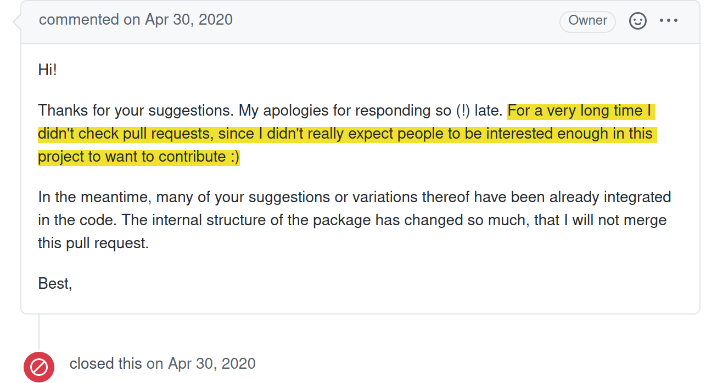

```{r setup, include=FALSE}
options(htmltools.dir.version = FALSE)
knitr::opts_chunk$set(
  echo = FALSE,
  fig.align = "center",
  out.width = "100%"
)
```

```{css}
li, p {
  font-size: 1.7rem;
  line-height: 150%;
}
```

## A very personal topic

--

- Got started with R package development by contributing to other packages
- Author of some package but contributor (occasional or recurring) of many others

--

### How to reproduce this transition?

### How to make sure projects are not simply open-source but community projects?

---

## Many users think their feedback is not interesting enough

```{r, out.width='65%', fig.alt="Twitter conversation with person 1 saying \"Does anyone else refresh the page every 5 min after posting an issue on Github to see if the developer has answered, or am the only one that anxious?\" and person 2 answering \"Never because I know they don't actually want to deal with that shit. I feel lucky to ever get a reply.\""}

```

???

usual pattern:
something is broken/unclear -> give up and move on

we want: 
something is broken/unclear -> report the issue

---
class: center, middle, inverse

# My story

### How I got started and fell in love with package development

---
class: highlight-last-item

## My first contribution to an R package

0. Always on the look out for new features, avid reader of `NEWS` files

--

0. Browsed the GitHub repo (https://github.com/rmaia/pavo)
0. Noticed an open issue I knew how to solve

--

0. Contacted the devs `r emo::ji("scream")` and offered a PR 

```{r, eval = FALSE}
"placeholder"
```
    
???

- didn't know the etiquette
- was afraid they would be offended I told them their software is not perfect

--

Continued contributing and eventually became an official maintainer

---
layout:true
## An alternative look at the problem

---

### Many users think their feedback is not interesting enough

```{r, out.width='65%', fig.alt="Twitter conversation with person 1 saying \"Does anyone else refresh the page every 5 min after posting an issue on Github to see if the developer has answered, or am the only one that anxious?\" and person 2 answering \"Never because I know they don't actually want to deal with that shit. I feel lucky to ever get a reply.\""}

```

---

### Many ~~users~~ developers think their ~~feedback~~ package is not interesting enough

```{r, fig.alt="Screenshot from a GitHub comment at https://github.com/ropensci-org/community-calls/issues/21#issuecomment-767504258. Text reads: \"Just an anecdote of my most active repository, in terms of issues. This repository is a 5 years old program we wrote for an assignment of my M.Sc. We didn't expect to be used outside the class, but as it was left on Github some people found it and used it. We realized people were using it when some people starred the repo, then some time later some users reported troubles they had with it.\""}

```

???

https://github.com/ropensci-org/community-calls/issues/21#issuecomment-767504258

---

```{r, out.width='75%', fig.alt="Screenshot from a GitHub comment closing a pull request with the following text: \"Hi! Thanks for your suggestions. My apologies for responding so (!) late. For a very long time I didn't check pull requests, since I didn't really expect people to be interested enough in this project to want to contribute :) In the meantime, many of your suggestions or variations thereof have been already integrated in the code. The internal structure of the package has changed so much, that I will not merge this pull request. Best, [Maintainer name]\""}

```

???

Damaging consequences

Seems like a communication problem

---
layout:false
class: center, middle, inverse

# How to foster a community around your package

### Closing the communication gap between users and developers

???

Tips to make it less scary to give feedback / contribute
Based on my experience -> very subjective. Interesting in discussing this
after.

---
class: highlight-last-item

## Show that you are available and want to communicate

- If possible, allow to contact you through various platforms

--

- Share the recent changes (`NEWS.md`) of your package on these platforms

--

- Open issues with unresolved questions (possibly tag as `help-wanted`)

---
layout: true

## Don't let contributors work for nothing / feel ignored

---

- Acknowledge feedback:
  - with a quick (even short) answer
  - with a shout-out / addition to contributors later

---

- Acknowledge feedback

- Always push your recent work in the public repo (don't keep local branches)

---

- Acknowledge feedback

- Always push your recent work in the public repo (don't keep local branches)

- Share upcoming development (roadmap) of your package

--

```{r, out.width='75%', fig.alt='Screenshot from Scott Chamberlain sharing notes from a (private) staff meeting on the public repository at https://github.com/ropensci/biweekly/issues/32'}
knitr::include_graphics("figs/scott_notes.png")
```

---

- Acknowledge feedback

- Always push your recent work in the public repo (don't keep local branches)

- Share upcoming development (roadmap) of your package

- `usethis::use_release_issue()`

```{r, echo = FALSE, out.width='75%', fig.align='center', fig.alt='Screenshot from `usethis::use_release_issue()` documentation. The sentence `"It also helps watchers of your package stay informed about where you are in the process.\" is highlighted.'}

```

---
layout:false
layout:true

## Reduce the workload

---

- Disable failing tests

```{r, out.width='75%', fig.alt='Screenshot of CI failure unrelated to the current pull request throwing off an occasional contributor'}

```

---

- Disable unnecessary bots (e.g. coverage bot)

```{r, echo = FALSE, out.width='70%', fig.align='center', fig.alt='Screenshot from codecov-io bot on a pull request'}

```

???

To be honest, still not sure how to read it today...

---
layout:false

## But leave opportunities to learn

- Avoid using the 'Allow edits from maintainers' feature

```{r, fig.alt='Screenshot presenting the "Allow edits from maintainers" feature'}
knitr::include_graphics("https://docs.github.com/assets/images/help/pull_requests/allow-maintainers-to-make-edits-sidebar-checkbox.png")
```

---

class: middle, inverse

# Summary

- Show that you are available and want to communicate
- Don't let contributors work for nothing / feel ignored
- Reduce the workload
- But leave opportunities to learn

???

We're not perfect ourselves and still have a lot to do

Over to Steffi
